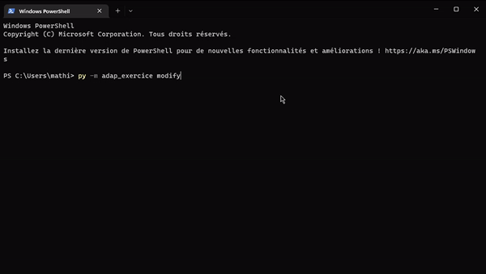

# Exercice Adaptatif

Ce package permet la résolution d'un exercice. Celui-ci permet aussi de modifier les paramètres de l'exercice pour laisser plus de liberté à l'utilisateur. Les réponses données par le fichier s'adapteront alors aux paramètres.

L'exécution du package permet la création d'un fichier PDF à l'aide du langage LaTeX. Le fichier TeX est lui aussi récupérable pour une modification plus précise du fichier.

---
## Exercice 
A monopoly operates for two periods and
produces a homogenous good whose quality is either high or low (the monopoly cannot choose the quality of the good). 

In the first period, the quality of the good is unobserved by consumers and their demand is $q_1$ = $s_1$ − $p_1$, where $s_1$ is the perceived quality of the good and p1 is the price in period 1. 

In the second period, the quality of the good becomes common knowledge and the demand for the good is $q_2$ = 4 − $p_2$ if the quality is high and $q_2$ = 2 − $p_2$ if the quality is low, where $p_2$ is the price in the second period. 

The
per unit cost of production is 1 in the first period, and 1 − $\gamma q_1$ in the second period, where $\gamma$ is a positive constant that reflects a learning-by-doing effect : the more the firm produces in period 1, the lower is its per unit cost in period 2. Assume that $\gamma$ = $\frac{1}{4}$ if the monopoly produces a high quality product and $\gamma$ = $\frac{1}{2}$ if the monopoly produces a low quality product. For simplicity, assume that there is no discounting.

### Questions :

1. Solve the monopoly’s problem in period 2 and compute the monopoly’s profit at the optimum, taking $q_1$ as given (recall that $q_1$ determines the per-unit cost of production in period 2).

2. Write out the sum of the monopoly profits in periods 1 and 2 as a function of $p_1$, given the monopoly type, assuming that consumers believe that (1) $s_1$ = 4 and (2) $s_1$ = 2.

3. Now suppose that in period 1 the monopoly chooses a price, $p_1$, and a level of uninformative advertising, A. Solve for the strategy of a low type monopoly in a separating equilibrium.

4. Let A($p_1$) define, for each period 1 price $p_1$, the minimal amount of advertising required by a high quality monopoly in order to deter a low quality monopoly from mimicking it. Given your answers to parts (2) and (3), compute $A(p_1)$ and show it in a figure. Moreover, compute the prices at which $A(p_1)$ crosses the horizontal axis.Explain the meaning of these crossing points.

5. Solve for the price that a high quality monopoly will charge in a Pareto undominated separating equilibrium (one where a high quality monopoly advertises just enough to induce separation, or more precisely, one where consumers believe that the monopoly must be of a high quality if they observe a pair $(p_1,A)$ which is a weakly dominated strategy for a low quality monopoly) and compute the amount of advertising that it will choose.

6. Compare your answer in part (5) to the optimal strategy of a high quality monopoly in the full information case (the case where the quality is common knowledge even in period 1). Does the monopoly underprice or overprice in equilibrium, relative to the full information case ? Explain why the price distortion could serve as a signal for quality in this particular case.

---
## Présentation du module

### Installation

Il y a deux manières pour installer ce module :

1. Installer le package depuis PiPy avec `pip` :
```sh
py -m pip install adap_exercice
```

2. Installer le module à partir du répertoire téléchargé sur GitHub (en utilisant votre propre chemin où se situe le dossier) :

```sh
py -m pip install "C:/Users/Username/Downloads/adap_exercice"
```
### Fonctionnement

Ce module contient deux fonctions utilisables en ligne de commandes par l'utilisateur :

1. La première permet d'obtenir la version originale de la correction de l'exercice, tous les calculs étant fait de manière symbolique grâce au module `sympy`.

```sh
py -m adap_exercice original
```

2. La seconde permet de modifier les paramètres au choix de l'utilisateur à l'aide d'un prompt :
    1. Les valeurs de qualité haute et basse $s_1$ et $s_2$.
    2. Les valeurs des $\gamma$.

<p align="center">



</p>

Enfin, la commande :

```sh
py -m adap_exercice --help
```
Elle permet d'obtenir les différentes informations sur le package, ainsi que l'auto-complétion et les descriptions des commandes.
### Fichiers

Le fichiers PDF s'ouvrira normalement automatiquement dans une fenêtre. Il est cependant possible de récupérer les deux fichiers dans le dossier `C:/Users/Username`.